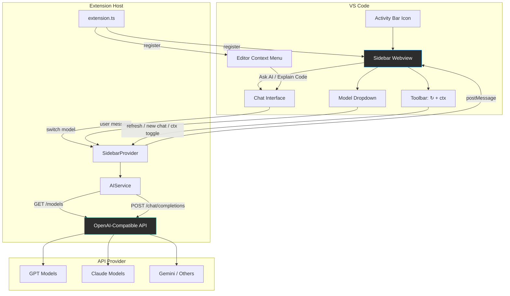
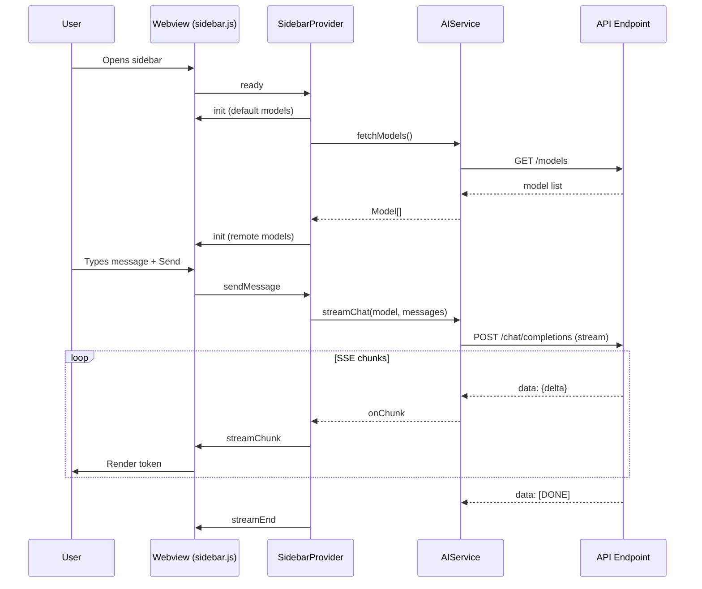

# Multi-Model AI Assistant for VS Code

A VS Code extension that connects to any OpenAI-compatible API and lets you switch between 100+ AI models on the fly — all from a sidebar chat panel.

## Features

- **Auto-Discover Models**: Automatically fetches available models from your API endpoint. No hardcoding needed
- **Live Model Switching**: Switch models mid-conversation via a dropdown. The new model sees the full chat history for seamless context continuity
- **Streaming Responses**: Real-time token-by-token output, just like ChatGPT
- **Code Actions**: Select code in the editor, right-click "Ask AI" or "Explain Code" — the snippet is sent directly to the chat
- **New Chat**: Hit `+` to start a fresh conversation at any time
- **Context Toggle**: `ctx` button controls whether the new model sees previous chat history or starts fresh
- **Theme Adaptive**: Follows your VS Code dark/light theme automatically

## Compatible API Providers

Works with any service that supports the OpenAI Chat Completions format:

| Provider | Base URL |
|----------|----------|
| ZenMux | `https://zenmux.ai/api/v1` |
| OpenRouter | `https://openrouter.ai/api/v1` |
| OpenAI | `https://api.openai.com/v1` |
| Any OpenAI-compatible | `https://your-provider/v1` |

## Install

### From VSIX

```bash
# Build it yourself
./build.sh

# Or install a pre-built .vsix
code --install-extension vscode-multi-model-0.2.0.vsix
```

### From Source (Development)

```bash
git clone <repo-url>
cd vscode-multi-model
npm install
npm run compile
```

Then press `F5` in VS Code to launch a development host with the extension loaded.

## Setup

After installation, open VS Code Settings and configure:

| Setting | Description |
|---------|-------------|
| `multiModelAI.apiKey` | Your API key |
| `multiModelAI.apiBaseUrl` | API base URL (e.g. `https://zenmux.ai/api/v1`) |

The model list loads automatically once both fields are set. Click `↻` to refresh manually.

## Usage

1. Click the **AI Assistant** icon in the activity bar (left sidebar)
2. Pick a model from the dropdown (auto-populated from your API)
3. Type a message and press **Enter** (or click **Send**)
4. Switch models anytime — the conversation history carries over
5. Click **+** to start a new chat

### Code Actions

Select code in the editor → right-click:
- **Ask AI** — send the selection with a custom prompt
- **Explain Code with AI** — get an explanation of the selected code

## Architecture



### Data Flow



### File Structure

```
src/
├── extension.ts            # Entry point: registers commands, views
├── sidebar/
│   └── SidebarProvider.ts  # Webview provider: model selector + chat UI
├── services/
│   └── aiService.ts        # API client: chat, streaming, model discovery
└── types.ts                # Shared types and default model list
media/
├── sidebar.html            # Chat UI markup
├── sidebar.css             # VS Code theme-aware styles
└── sidebar.js              # Frontend logic
```

Uses the OpenAI-compatible `/chat/completions` endpoint. Model switching is done by changing the `model` parameter — one base URL handles all providers.

## Development

```bash
npm run compile   # Build
npm run watch     # Watch mode
npm test          # Run tests
./build.sh        # Build + package .vsix
```

## License

MIT
